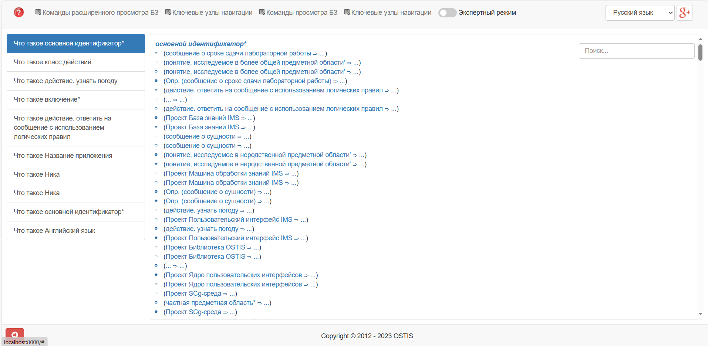

<p align="center"> Министерство образования Республики Беларусь</p>
<p align="center">Учреждение образования</p>
<p align="center">“Брестский Государственный технический университет”</p>
<p align="center">Кафедра ИИТ</p>
<br><br><br><br><br><br><br>
<p align="center">Лабораторная работа №4</p>
<p align="center">По дисциплине “Общая теория интеллектуальных систем”</p>
<p align="center">Тема: “Работа с проектом "NIKA" (Intelligent Knowledge-driven Assistant)”</p>
<br><br><br><br><br>
<p align="right">Выполнил:</p>
<p align="right">Студент 2 курса</p>
<p align="right">Группы ИИ-23</p>
<p align="right">Привезенцев М. А.</p>
<p align="right">Проверил:</p>
<p align="right">Иванюк Д. С.</p>
<br><br><br><br><br>
<p align="center">Брест 2023</p>

---

# Общее задание #
1. Изучить [руководство](https://github.com/ostis-apps/nika) по использованию NIKA.

2. Запустить NIKA посредством локальной машины (на домашнем ПК, ноутбуке, рабочей машине в аудитории и т.д.). Привести примеры использования проекта преподавателю.

3. Составить отчет выполненной работы в readme.md и разместить его в каталоге trunk\ii0xxyy\task_04\doc используя для этого функцию pull request.

# Результат #

```localhost:8000```:



```localhost:3033```:


Docker Desktop:

Вывод: изучил руководство по использованию "Nika" запустив данный проект на ноутбуке и составил отчёт по общему заданию предоставив все необходимые примеры и возможности использования системы NIKA.
